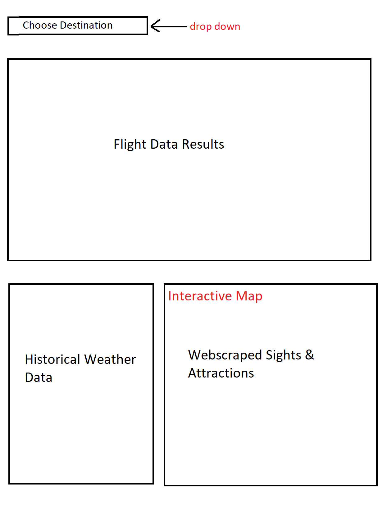

<h1>Travel Tips Dashboard</h1>

For our project, we will be creating a travel tips dashboard. Users will be able to choose from a selection of top travel locations in the US, and the dashboard will create an output of flight price information orgination from Indianapolis, average weather and local information (e.g. attractions/lodging/dining) for the desired location. 

Our data sources will be a combination the Skyscanner API (add link), a data base of historical weather (ten years of historical data/10,000+ records) and webscraping for third-party websites, with the project falling under the track of "A combination of web scraping and Leaflet or Plotly." We will also be implementing the user of JQuery as our additional library. 

Everything will generate on a single dashboard view, with default content loaded upon open. Users will choose a city from a drop down menu, and all data will update as selected. The local information view will populate on an interactive map.  

Beginning Data Sources:  
-https://rapidapi.com/skyscanner/api/skyscanner-flight-search  
-https://www.visualcrossing.com/weather-data  
-Yelp API

GitHub repo: https://github.com/Nsnewcomer92/project_two 

